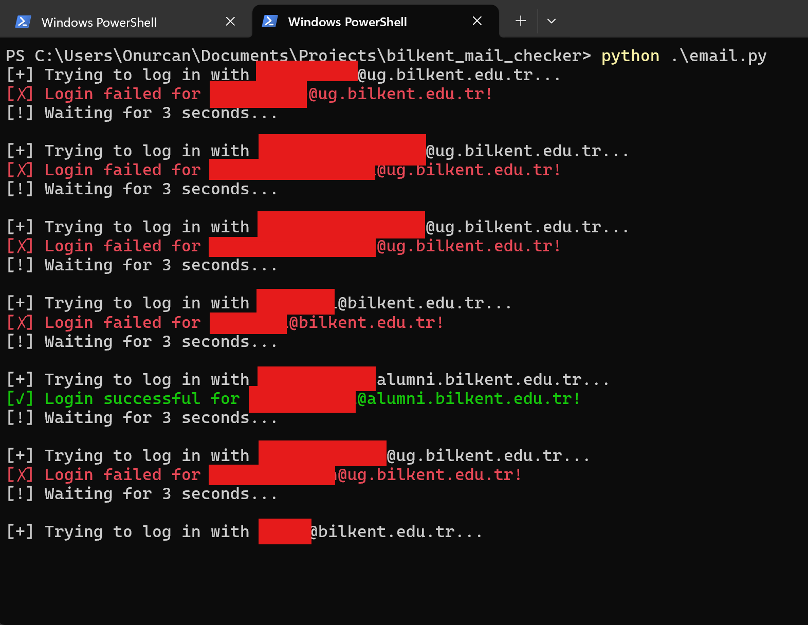

# Bilkent Webmail Account Checker

A Python script checking the validity of Bilkent University email accounts by attempting to log in using IMAP authentication. It reads a list of email-password combinations from a `.txt` file and tests them against Bilkent's mail server.




## Features
✅ Reads email-password pairs from `accounts.txt`  
✅ Uses **IMAP** to check login credentials  
✅ Displays **successful** (✅) and **failed** (❌) login attempts  
✅ Adds a **30-second cooldown** between login attempts to prevent rate limiting  
✅ **No file writes**—results are only displayed on the screen  

---

## How to Use

### 1️⃣ Prepare `accounts.txt`
Create a text file named `accounts.txt` in the same directory as the script. The file should contain email-password pairs in the following format:

```bash
user1@bilkent.edu.tr:password123 
user2@bilkent.edu.tr:12345678 
user3@bilkent.edu.tr:qwerty
```

Each line should have one email and password pair separated by a colon (`:`).

---

### 2️⃣ Run the Script
Run the Python script using:

```bash
python bilkent_checker.py
```

---

## Example Output

```bash
[+] Trying to log in with user1@bilkent.edu.tr...
[✓] Login successful for user1@bilkent.edu.tr!
[!] Waiting for 30 seconds...

[+] Trying to log in with user2@bilkent.edu.tr...
[✗] Login failed for user2@bilkent.edu.tr!
[!] Waiting for 30 seconds...
```

---

## Requirements

✅ Python 3.x
✅ A valid accounts.txt file
✅ Internet connection

## ⚠️ Disclaimer
🚨 This script is for educational and personal security testing purposes only.
🚨 Unauthorized use of this script on third-party accounts is illegal.
🚨 Too many failed login attempts may result in account lockout or IP ban. Use responsibly.
